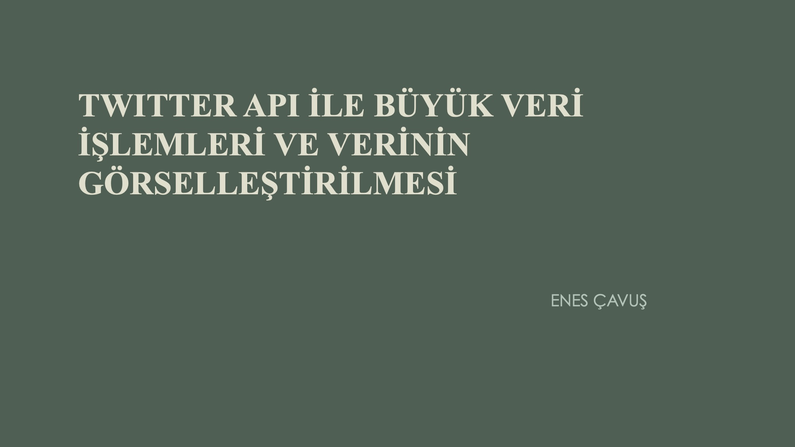

## ___This is a Thesis about Real Time Big Data Operations___

___End-To-End Coding and Design by ENES ÇAVUŞ___

### Overall Application ScreenShot

---

### Gained Skills

Hadoop - Kafka - Spark - Hive - Python - JSON - SQL - NoSQL

**Real Time Data:**

- Gathering & Management
- Transfer / Pipelines & Manipulations 
- Analysis & Visualization on Web 
- Storage Management
- Better Understanding of JSON and Python Scripts

---

### Presentation Preview 

---

---

---

---

---

### Sunumun Devamı -> [burada](https://github.com/enescavus/Big-Data/blob/main/TezSunum-RealTimeBigDataOperations.pdf)

___ENES ÇAVUŞ___